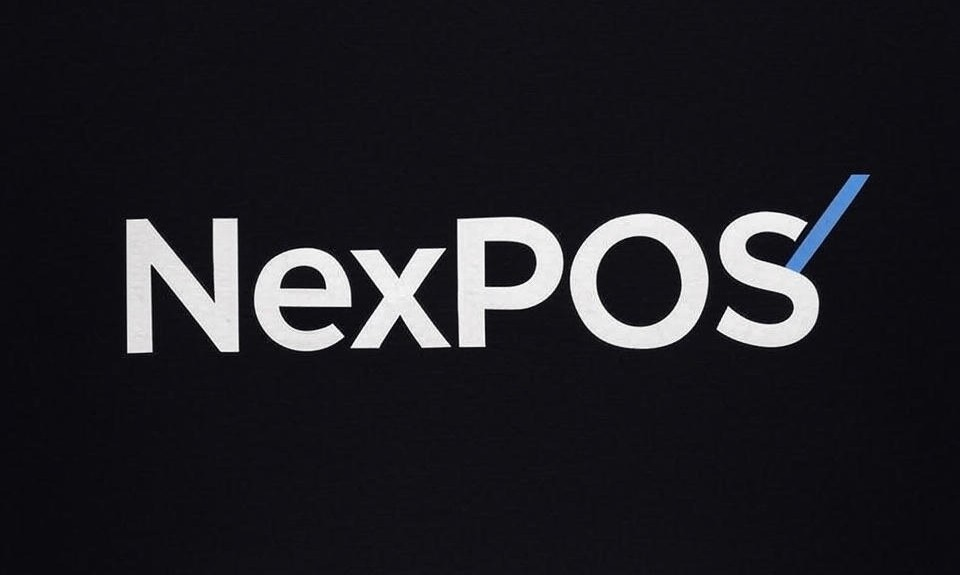

<!-- BANNER -->
<p align="center">
  
</p>

<!-- BADGES -->
<p align="center">
  
  
  
  
</p>

# 📘 Nexpos 

> A monolithic service for managing an online point-of-sale (POS) system, developed in Go with integration to external services (Firebase), PostgreSQL database, Redis cache, and Swagger for API documentation.
---

## 📑 Table of Contents

- [Introduction](#-introduction)
- [Technologies](#-technologies)
- [Architecture](#-architecture)
- [Installation](#-installation)
- [Configuration](#-configuration)
- [Usage](#-usage)
- [Contribution](#-contribution)
- [License](#-license)

---

## 📖 Introduction

**NexPOS** is an open-source Point-of-Sale (POS) system designed to manage online sales, inventory, and customer interactions. 
Built with a focus on **scalability**, **security**, and **clean architecture practices**, it provides a robust foundation for e-commerce solutions. 
Whether you're running a small store or a large retail operation, NexPOS offers tools for order processing, user management, and real-time reporting.

---


## ✨ Features

- Multi-user support with Firebase authentication
- Real-time inventory management with Redis caching
- RESTful API with Swagger documentation
- Order processing and payment integration
- Customizable reporting and analytics

---

## 🛠 Technologies

- [Go](https://go.dev/) – Main programming language
- [Docker](https://www.docker.com/) – Containerization
- [GORM](https://gorm.io/) – ORM for PostgreSQL
- [PostgreSQL](https://www.postgresql.org/) – Relational database
- [Redis](https://redis.io/) – In-memory data store
- [Firebase](https://firebase.google.com/) – Authentication and external services
- [Swagger](https://swagger.io/) – API documentation
- **Clean Architecture / Ports and Adapters**

---

## 🏗 Architecture

The project follows **Clean Architecture** principles:

- **Domain** → Business rules
- **Usecases** → Application use cases
- **Adapters** → External interfaces (DB, APIs)
- **Infrastructure** → Configurations and frameworks

---


## 🔧 Configuration

Environment variables are defined in `.env`.  
Example:

```env
HTTP_PORT=3000
HTTP_DISABLE_STARTUP_MESSAGE=true

POSTGRES_HOST=localhost
POSTGRES_PORT=5432
POSTGRES_USER=postgres
POSTGRES_PASSWORD=secret
POSTGRES_NAME=nexpos

#another enviroments...
```
---

## ⚙️ Installation

```bash
# Clone repository
git clone https://github.com/robertobferraz/nexpos.git

# Access directory
cd nexpos

# Run with Docker
make up 
```

---

## 🚀 Usage

```bash
# Run locally
go run main.go
```

Access: [http://localhost:8080](http://localhost:8080)

---

## 🤝 Contribution

Contributions are welcome!  
Steps:

1. Fork the project
2. Create a branch (`git checkout -b feature/new-feature`)
3. Commit changes (`git commit -m 'Add new feature'`)
4. Push (`git push origin feature/new-feature`)
5. Open a Pull Request

---

## 📜 License

This project is licensed under the [MIT License](LICENSE).

---
